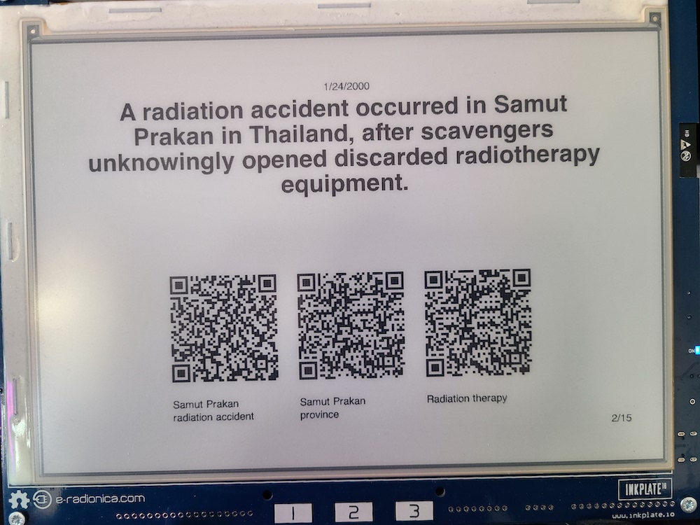
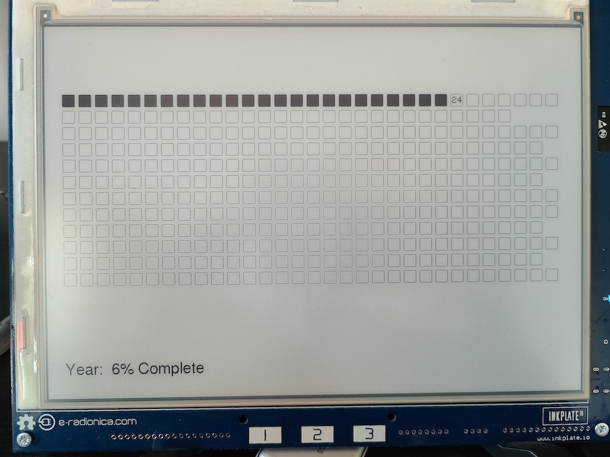

# WIP

# What is this?

This repo is the source code for a personal display that uses an Inkplate 10 e-ink panel. It will ultimately show a series of "what happened on this day" images, current year progress indicator, and the weather forecast

# Current State

As of now the display can:

- Display images based on the date
  - images are loaded from a micro SD from a path `day-images/%M/%D/%I.png`
    - `%M` is the month
    - `%D` is the date
    - `%I` is the image index
- Display a matrix of boxes, each representing a day in the year, acts as a visual representation of how far in the year we are
  - As the date changes, boxes are filled in

# TODO

- [ ] display weather forecast
- [ ] sub reddit info
- [ ] dad jokes
- [ ] include scripts used to generate images
- [ ] extract all networking code
- [ ] battery indicator
- [ ] make it configurable via remote service or internal server
  - [ ] screen size
  - [ ] duration between slides
  - [ ] location (for weather)
  - [ ] network credentials
- [ ] remove the use of `String`

# Images

